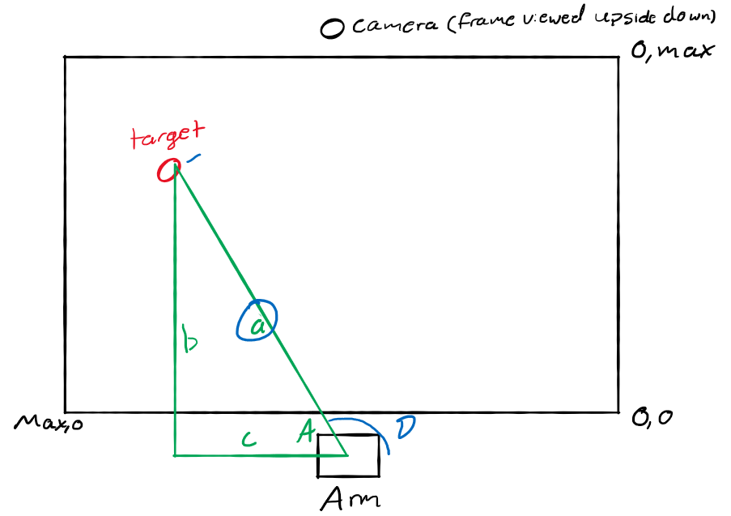
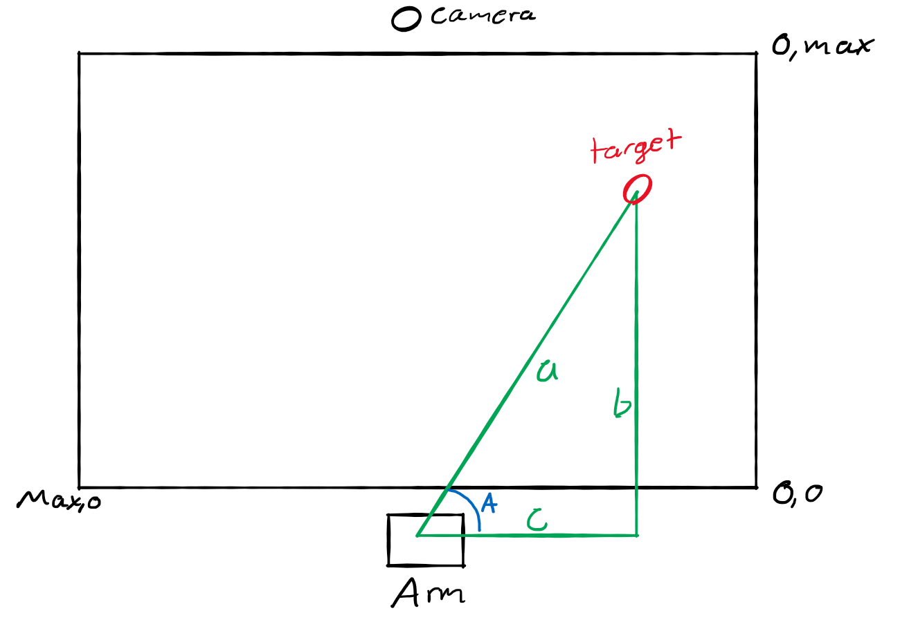
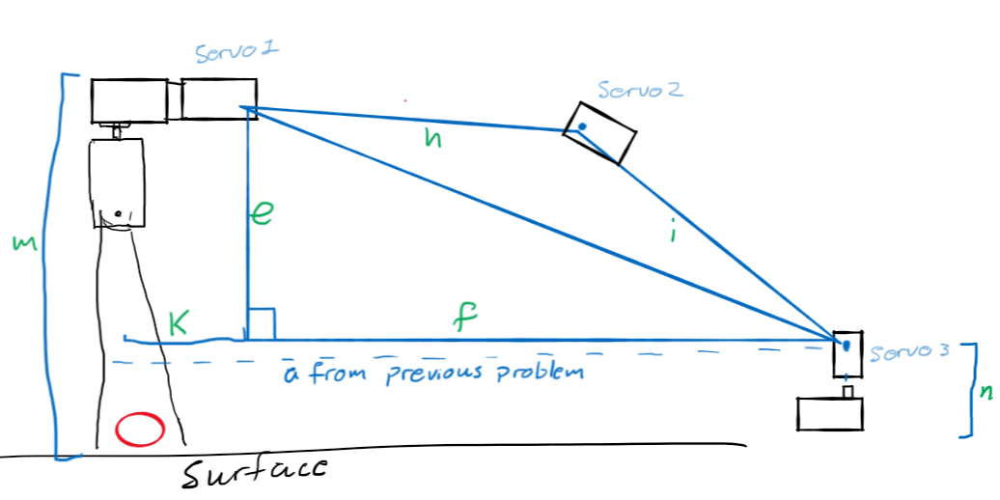
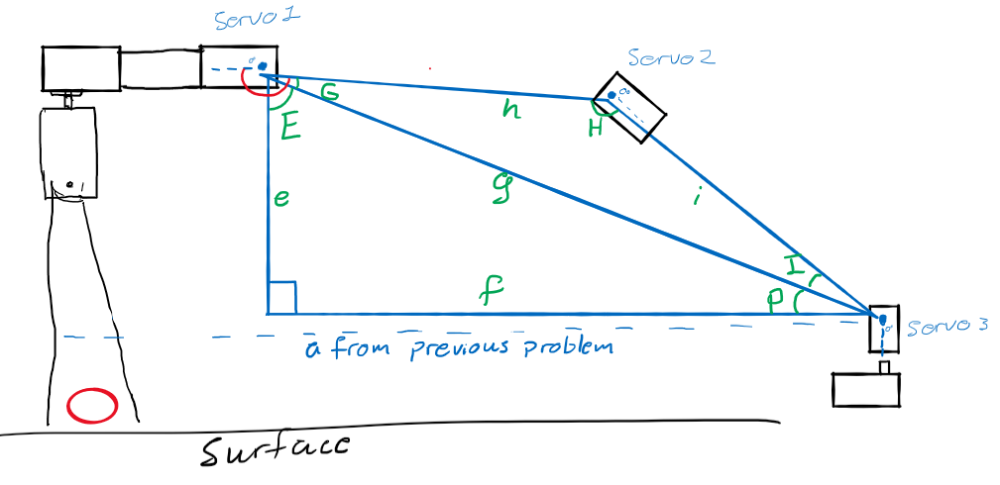

# CSE310_Software_Portfolio

# Overview
Our goal is to learn how to use ROS to interact with the physical world and 
people. We want the arm to reach for a point designated by the user by touching
the point. It will also respond to voice commands (turn left or right, up or 
down, etc.). We will be learning Open CV and speech recognition to utilize the
commands mentioned earlier. 
[Video](https://www.youtube.com/watch?v=cv7r70pevNQ).


# Development Environment
The Raspberry Pi acts as the brain of the project, running Robot Operating 
System Noeticwith Python as the main language and a little C++. OpenCV (as used
with Google's Coral) is used to find objects. PocketSphinx translates speech to voice 
commands (for now, just 'object' to locate an object and throw it). Flite, a speech-to-text
program, is used to repond to the user. 

# Explanation
Upon receiving a voice command ("object") a message is sent to move_arm.py containing the coordinates of an object in the image (if found). move_arm.py calculates the position of each servo in the arm to reach the object. Finally, it sends a message to servo.py containing each servo coordinate. 

From here on out, 'y' refers to a position on the y axis and x refers to a position on the x axis. Absolute value will be written 'abs' (as in the python function). 

## Solving for base (A.K.A. "hip")
First, we need to find the base servo's angle ('A') and the distance between the arm and the object ('a'). 
Find side 'a' and angle 'A' as shown in fig. 1  

```py3
# Find side 'a'
b = target_y - arm_y # Since arm y is below 0, target is farther from the arm than the bottom of the frame.
c = target_x - arm_x
a = sqrt(b**2 + c**2)
```

#### Fig. 1 - Object left of arm


```py3
# Find angle 'A'
A = deg(acos(abs(c)/a))
# Use that to calculate the base servo's angle
if c > 0:
  # the object is to the left of the arm. fig. 1
  base_angle = 180 - A
else: 
  # the object is to the right of the arm. fig. 2
  base_angle = A
```

#### Fig. 2 - Object right of arm



## Calculate arm position

Next, we need to solve the position of the arm (fig. 3). We'll start by getting the lengths we can easily get. 
k = the horizonal measured distance from the servo 1 joint to the center of the hand
m = measured hand height up to the joint at servo 1
n = measured distance from the surface to servo 3
h = measured distance servo 1 to servo 2
i = servo 2 to servo 3

```py3
k = 52
f = a - k
m = 72
n = 30
e = m - n
h = 52
i = 52
```

#### Fig 3 - Measure and calculate the sides' lengths


Servo 1
```py3
E = atan(abs(f)/e)
G = deg( acos((g**2 + h**2 - i**2) / (2.0 * g * h)))

if f > 0:   # fig. 3
  angle = 90 + E + G
else:       # fig. 5
  angle = E + G
```

Servo 2
```py3
H = deg( acos((i**2 + h**2 - g**2) / (2.0 * i * h)))
angle = H
```

Servo 3
```py3
I = deg( acos((g**2 + i**2 - h**2) / (2.0 * g * i)))
P = asin( e / g )

if f> 0:  # fig. 3
  angle = 90 + I + P
else:     # fig. 5
  angle = 180 + I + E 
```

#### Fig 4 - Servo angles with object is far


#### Fig 5 - Servo angles when object is close


# Useful Websites
[Stack Overflow](https://stackoverflow.com/)  
[ROS Wiki](http://wiki.ros.org/Documentation)  
[YouTube](https://youtube.com)

# Requirements
Flite  
PocketSphinx  
OpenCv  
ROS  
Coral - Run "git clone https://github.com/google-coral/examples-camera.git --depth 1" in terminal

# TODO
- [ ] Write setup script
- [ ] Switch from Coral to basic OpenCV to improve costs

## Authors:
### Jeff Marsh and Adam Amott
